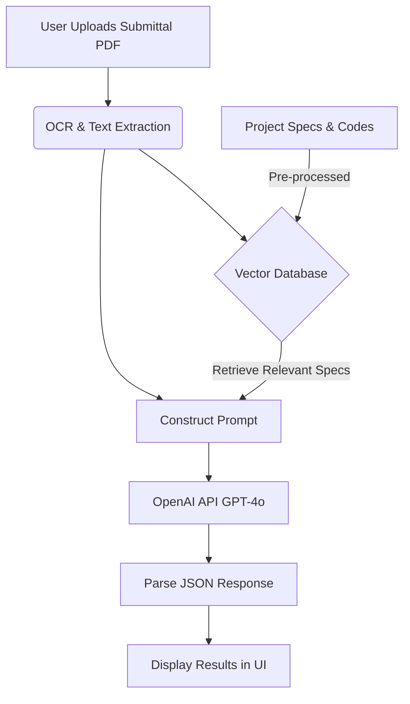

# Connecting MIOS to an LLM (ChatGPT)

Connecting your MIOS application to a real large language model (LLM) like OpenAI's GPT-4 (the model behind ChatGPT) to perform actual document analysis involves a multi-step architecture.

Since you are dealing with construction documents (Submittals, Specs, Drawings), which are often large PDFs containing a mix of text, tables, and sometimes diagrams, the process is more complex than just sending a simple text prompt.

Here is a breakdown of how we would build this integration.

## 1. The Core Architecture (RAG Pipeline)

To make the AI useful, it needs context. It needs to know your project's specific specs and local building codes. We achieve this using a pattern called **Retrieval-Augmented Generation (RAG)**.



## 2. Step-by-Step Implementation Guide

### Step 1: Document Processing & OCR
When a user uploads a PDF (e.g., a chiller submittal or a 500-page spec book), we cannot just send the entire file directly to the LLM (it's too large and expensive).
*   **Tool:** We need an Optical Character Recognition (OCR) service to convert the PDF into readable text.
*   **Options:** 
    *   **LlamaParse** or **Unstructured.io** (Great for complex documents with tables).
    *   **AWS Textract** or **Google DocumentAI** (Enterprise-grade OCR).
    *   For simpler, text-heavy PDFs, standard libraries like `pdf-parse` (Node.js) might suffice.

### Step 2: Chunking and Vector Database (The MIOS "Brain")
Once we have the text from your Spec books and building codes, we need to store them so the AI can search them quickly.
*   **Chunking:** We break the massive spec documents into smaller, logical "chunks" (e.g., by paragraph or section).
*   **Embeddings:** We convert these chunks into numbers (vectors) using an embedding model (like OpenAI's `text-embedding-3-small`).
*   **Vector DB:** We store these vectors in a specialized database. 
*   **Options:** **Pinecone**, **Weaviate**, or even a **PostgreSQL** database with the `pgvector` extension.

### Step 3: The API Route (Next.js Backend)
When the user clicks "Review Compliance" on a submittal:
1.  **Extract:** We OCR the *uploaded submittal*.
2.  **Retrieve:** We query the Vector DB: *"Find all sections in the project specs related to Chillers, Vibration Isolation, and Seismic requirements."*
3.  **Prompt Construction:** We build a prompt for OpenAI.

### Step 4: Connecting to OpenAI (ChatGPT API)
We send the constructed prompt to OpenAI using their official Node.js SDK or the specialized **Vercel AI SDK**.

*   **You will need:** An [OpenAI API Key](https://platform.openai.com/).
*   **The Model:** `gpt-4o` (GPT-4 Omni) is currently the best choice, as it's fast, relatively cheap, and can even accept images natively (useful if you want it to look at drawings).

**The Prompt format looks something like this:**

```text
You are a Senior MEP Project Manager and Code Compliance Expert in the DMV area.

I am providing you with the text extracted from a contractor's submittal:
[INSERT SUBMITTAL TEXT HERE]

I am also providing you with the relevant sections from our project specifications:
[INSERT RETRIEVED SPEC TEXT FROM VECTOR DB HERE]

Task: Review the submittal against the provided specifications.
1. Identify all verified compliant items.
2. Identify all critical deviations or missing information.
3. Return the result strictly as a JSON object matching this schema:
{
  "summary": "string",
  "matches": ["string"],
  "deviations": ["string"]
}
```

### Step 5: Returning to the UI
OpenAI returns the JSON object. Our Next.js API route sends this JSON back to the frontend.
The `DocumentUploadPanel` component we just built takes that real data (instead of the `setTimeout` mock data) and renders the badges, warnings, and compliance checks.

## Summary of Technologies Needed to Start

If we were to start building this right now, the modern, standard stack for this in a Next.js app is:

1.  **OpenAI Account:** For the API key (LLM and Embeddings).
2.  **Vercel AI SDK:** A library that makes calling OpenAI from Next.js very easy.
3.  **Pinecone (or Supabase/pgvector):** To store the specification text for cross-referencing.
4.  **PDF Parsing Library:** To extract the initial text from uploads.

## How to Proceed

If you want to start building this, the best first step is to **create a simple text-only integration** before tackling massive PDF spec books and vector databases. 

1.  Get an OpenAI API key.
2.  We install the `openai` and `ai` (Vercel AI SDK) packages.
3.  We create a real `/api/analyze-mock-text` endpoint that sends a hardcoded string to ChatGPT and returns the structured JSON response to your new UI. 
4.  Once that works, we can tackle PDF uploading and text extraction.
